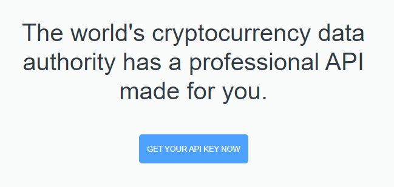

# Guide
## Installation process
Clone the repo

```bash
git clone https://github.com/missaelcorm/cryptoCurrency.git
```

Get into the project root folder

```bash
cd cryptoCurrency
```

### Create virtual virtual environment
Then you should create a virtual environment named .venv

```bash
python -m venv .venv
```

and activate the environment.

In a Windows terminal

```bash
.venv\Scripts\activate.bat
```

Then you should install the requirements

```bash
pip install -r requirements.txt
```

## Setting up your API key
To get your API key, you need to get into [CoinMarketCap - Developers](https://coinmarketcap.com/api/)
and click on "GET YOUR API KEY NOW" button.



Then a form will be displayed, and you need to sign up with your
own data.

![[Pasted image 20220505125838.png]]

Note: Be sure about to select **Basic - Free basic access for personal use** as **Plan**

Then you need to log in. Once you are logged in, that should show you the **Dashboard** page.

And should show you the **API Key**'s section.

![[Pasted image 20220505130437.png]]

Click on **COPY KEY** and save your API Key

## Setting up your API Key on the Web App
Go to **Modules** folder and open **apiSession.py** with any text editor.

> cryptoCurrency/Modules/apiSession.py

Once you've opened **apiSession.py** locate the **startHeadrs()** function.

```python
# --- Starts the session ---
def startHeaders():
    # Create the headers using our API key
    YOUR_API_KEY = "API Key"
    headers = {
    'Accepts': 'application/json',
    'X-CMC_PRO_API_KEY': f'{YOUR_API_KEY}'
    }
    # Start the session to the API
    global session
    session = Session()
    session.headers.update(headers)
```

And in **YOUR_API_KEY** variable, put your API Key.

```python
YOUR_API_KEY = "API_Key"  # Change "API_Key" an put your API Key between ""
```

Once you've done, save the file, and you'll be ready.

## Build and run the Application Locally

```bash
streamlit run streamlit_app.py
```

Then it should you display two links to run the Web App on a browser locally.

## Example of Web App running

